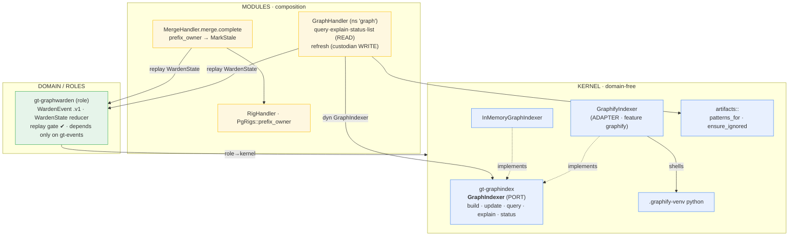
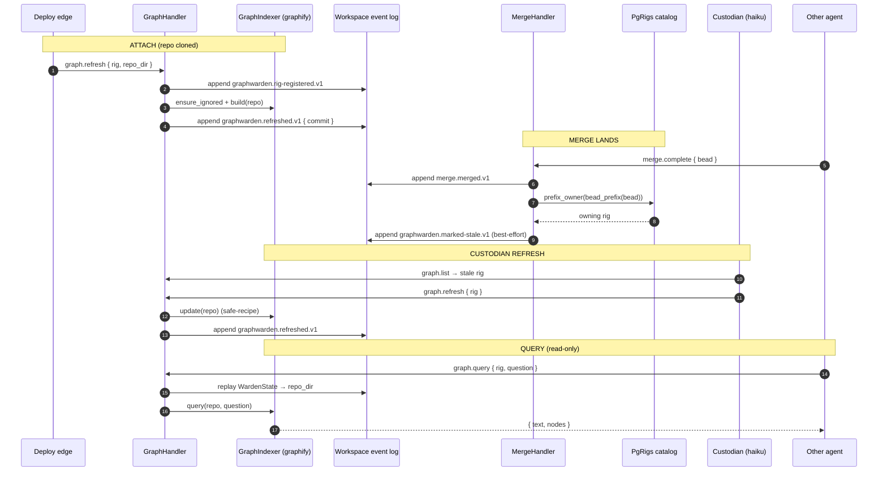
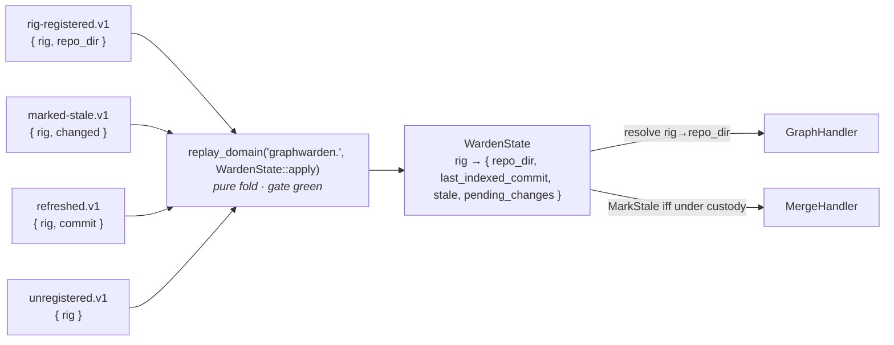

# 10 · Per-rig knowledge graph (tool-agnostic, agent-custodied)

Epic `hq-graphrig`. When a repo is attached to a rig, a **custodian agent** keeps a
codebase knowledge graph fresh for it; every other agent **only queries** the graph for
context. Two things stay replaceable:

1. **The graph tool** — graphify today, swap by writing a new adapter + flipping config.
2. **The custodian agent** — Haiku today, swap by a launch binding (config, not code).

Naming rule: the neutral layer is always `graph*` (`gt-graphindex`, `GraphIndexer`,
`gt-graphwarden`, `graph.*` MCP, `.graphindex/`); the word `graphify` appears **only** inside
the one concrete adapter and its real artifact paths.

## Pieces

| Concern | Where | Notes |
|---|---|---|
| Tool-neutral port | `crates/kernel/gt-graphindex` · `GraphIndexer` | `build/update/query/explain/status`; `InMemoryGraphIndexer` test double. Kernel tier so a *role* can depend on it without a domain→domain edge (docs/03 Rule 4). |
| graphify adapter | same crate, feature `graphify` · `GraphifyIndexer` | Shells the repo's `.graphify-venv` python. `build`/`update` run the deterministic **AST** path only — semantic (LLM) re-extraction is the custodian agent's job, not a library's. |
| Custodian role | `crates/domain/roles/gt-graphwarden` | Event-sourced (gt-witness shape). Tracks per-rig freshness: `RigRegistered` → `MarkedStale` → `Refreshed` → `Unregistered`, kebab `.v1` kinds, pure replay fold (gate green). |
| Read query surface | `crates/modules/gt-composition/src/mcp/graph.rs` · `GraphHandler` | MCP `graph.query / explain / status / list`. Resolves rig→repo_dir by replaying the warden's events. **Read-only by construction** — no graph write tool is exposed, so "agents only query" holds. |
| Ignore propagation | `gt-graphindex::artifacts` · `patterns_for` / `ensure_ignored` | Single source of ignore patterns. `ensure_ignored(repo, tool)` writes them into a repo's local `.git/info/exclude` (never its tracked `.gitignore`, since a rig may be a repo we don't own). |

## The two swap points

- **Swap the tool:** implement `GraphIndexer` for the new tool in `gt-graphindex` behind its
  own feature, construct it where `GraphifyIndexer::new()` is wired
  (`gt-composition/src/bin/gt-mcp-server.rs`). The warden, the reactor, the MCP surface, and
  the ignore-propagation all keep working unchanged — they name only the trait. `patterns_for`
  learns the new tool's artifacts; the umbrella `.graphindex/` already covers it.
- **Swap the agent:** the warden role only records *what* needs (re)indexing; *who* runs the
  index is a launch binding the composition edge resolves (`graph.agent.backend`, default
  `haiku`). Changing it is config, not code.

## Components

## Runtime loop

## Event-sourced warden state (no actor in the server path)

## Status (2026-06-03) — epic complete

All 12 beads + the epic closed. Delivered: the port + graphify adapter + ignore patterns
(`.1/.2/.3`), the warden role with replay gate (`.6`), the read-only MCP query surface (`.10`),
the custodian write-trigger `graph.refresh` (`.9`), the merge→stale auto-arm (`.7`), ignore
propagation (`.11`), docs (`.12`/this). `.4`/`.5` were already provided by `hq-mod-hooks.9` and
`hq-core-port.5`; `.8` (build-on-attach) is a deploy-edge call to `graph.refresh` (the rig clone
lives outside gt-core), so no in-gt-core reactor.

Merge→rig routing was resolved **without** mutating `MergeEvent`: `MergeHandler` resolves the
owning rig from the merged bead via `PgRigs::prefix_owner(bead_prefix(bead))` and marks its
graph stale (best-effort). Still open for the operator:
`hq-gap-domain-taxonomy-add-discriminators-kernel-graphindex-role-graphwarden` (add the domain
enum discriminators; the beads were tagged provisionally).
