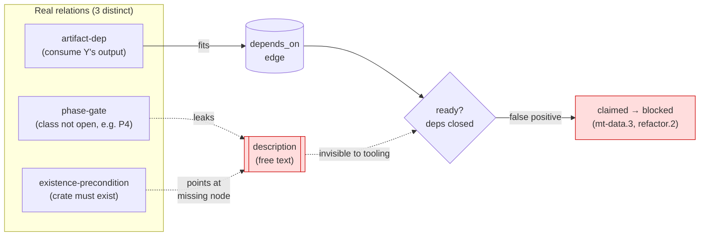
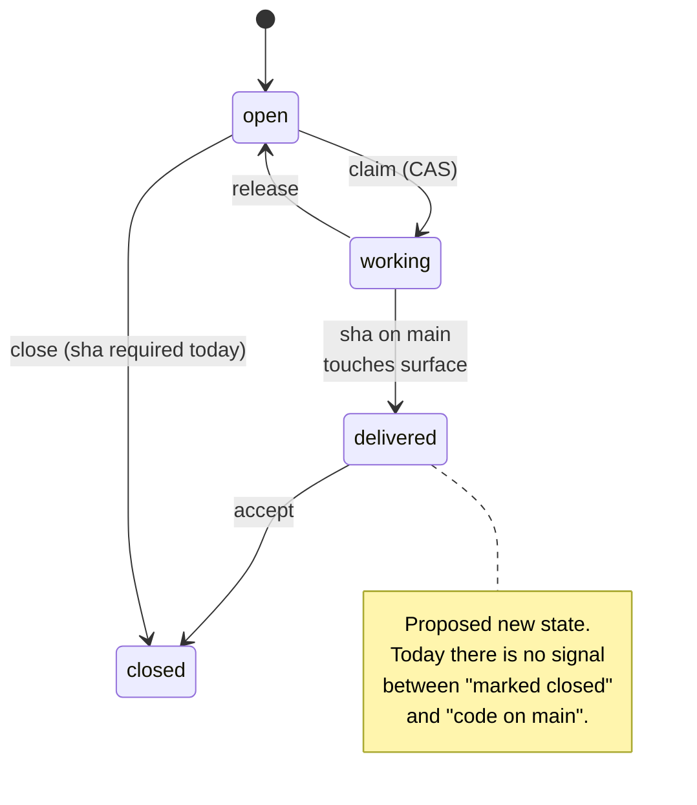
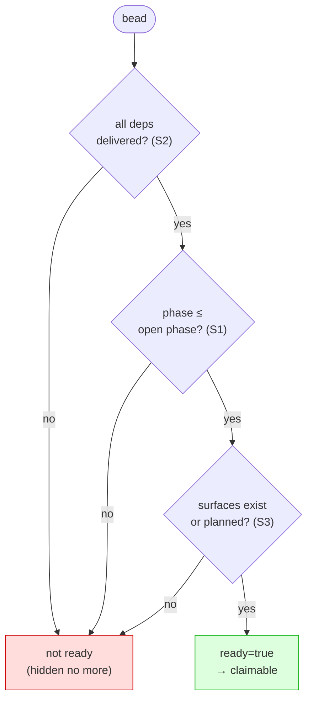
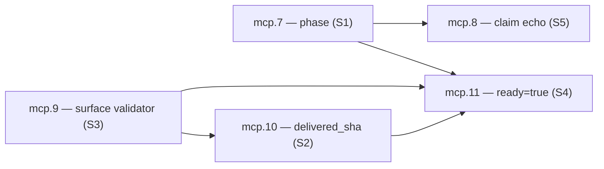

# 10 — Tracking-Model Refactor (authoritative dependency graph)

Status: **accepted** (2026-06-01). Root-cause analysis and restructure ratified.
**Ratified decisions:** (a) producer-node strategy = **hybrid 3→1** (phase-stamp now,
artifact-dep edges as `hq-core-port` lands — §5); (b) `phase_frontier.open_phase` = **P3**
(multi-tenant work open; P4 kernel migration gated). Beads `hq-core-mcp.7`–`.11` +
`hq-core-port` epic carry the work; no schema/tracker mutation lands until those beads
execute.

## 1. Problem

Agents pick work by reading the dependency graph: a bead is "ready" when every id in
its `depends_on` is `closed`. In practice this is wrong — beads that the graph reports
as ready turn out to be blocked, and the blocker is only discoverable by reading the
free-text `description` of the bead after claiming it.

Concrete cases hit on 2026-06-01:

- **`hq-mt-data.3`** (`rigs table DDL in template schema`) — `depends_on = [hq-mt-data.1]`,
  which is `closed`, so the graph says ready. The `description` says it is *"Blocked on
  the rigs domain/store porting into gt-core (`gt-rig`) … the DDL ships as that module's
  migration, not a hand-authored orphan"*. `gt-rig` does not exist in this repo. The real
  blocker (a P4 domain port) is encoded nowhere structural — only in prose.
- **`hq-mod-refactor.2/.7/.14`** — report ready (dep `refactor.1` closed) but target
  `crates/modules/` and `crates/domain/roles/` which are empty; they wrap gastown crates
  not yet migrated. `.2` is additionally superseded by the existing
  `crates/domain/platform/gt-issues` `IssuesModule`.
- **`hq-mod-flags.6`** — reported `open` long after its delivering commit `9ccdbd45` was
  on `main`. `closed` ≠ delivered; the flag lags merge by an unbounded interval.
- **`surface_json`** routinely points at non-existent paths (stale `apps/api/...` prefix;
  `migrations/gt-rig` which has no directory).

## 2. Root cause — three semantic conflations

The defect is in the **schema**, not in any single bead. Distinct relations are
compressed into one (or zero) fields, so the overflow leaks into free text where no
tooling can act on it.



### C1 — `depends_on` is overloaded

One edge type is being used for at least three different relations:

| Real relation | Meaning | Where it actually lives today |
| --- | --- | --- |
| **artifact-dep** | this bead consumes an artifact another bead produces | `depends_on` (correct) |
| **phase-gate** | an entire class of work is not open yet (e.g. P4 migration) | prose, or nowhere |
| **existence-precondition** | a crate/module must exist first | prose; the producing node often does not exist at all |

Collapsing three semantics into one edge is lossy. A phase-gate is not a per-bead edge —
it is a milestone predicate. An existence-precondition is an artifact-dep on a node that
hasn't been created. Both got dumped into `description`.

### C2 — `closed` is overloaded

`closed` conflates *"row marked done/accepted"* with *"artifact delivered and
verifiable on `main`"*. Because the two are not separated, `close.execute` had to bolt on
a mandatory `commit_sha` as delivered-code proof — a patch over the gap. Even so, a
`closed` dependency does not guarantee its code is on `main`, so dependency evaluation
remains unreliable.



### C3 — `surface_json` has no referential integrity

Surfaces are free-string paths with no link to the bead/crate that produces them. There
is nothing to reject a stale path (`apps/api/...`) or a path that does not exist yet
(`migrations/gt-rig`). Drift is guaranteed.

## 3. Proposed restructure

Four structural changes. S1–S3 fix the data model; S4 (+S5) removes the failure mode for
every agent.

```mermaid
flowchart LR
  A["artifact-dep"] -->|depends_on<br/>(artifacts only)| DO[("depends_on")]
  E["existence-precondition"] -->|producer bead| DO
  G["phase-gate"] -->|S1| PH[("phase P1..P4")]

  DO --> R{{"gt://issues?ready=true<br/>(S4, server-computed)"}}
  PH --> R
  SV[("surface validated<br/>vs git tree (S3)")] --> R
  DL[("delivered_sha (S2)")] --> R

  R --> SOUND["only sound beads<br/>surfaced to agents"]
  R --> CLAIM["claim echoes<br/>description/acceptance (S5)"]

  classDef good fill:#dfd,stroke:#0a0;
  class SOUND,CLAIM good;
```

### S1 — Un-overload `depends_on`

- `depends_on` carries **only artifact-deps** (X consumes what Y produces).
- New field **`phase`** (`P1..P4`, plus `ratified_at`) carries the phase-gate as a
  first-class milestone. A bead is gated when its `phase` exceeds the currently open
  phase — expressed once, not as an edge on every bead.
- Every existence-precondition becomes an artifact-dep **on the producing bead**. If no
  producing bead exists, one is created. **Hard rule: no blocker may live only in
  `description`.**

Rationale for a separate `phase` field rather than typing the edge (`{id, kind}`): avoids
migrating the JSON edge column and keeps phase queryable in one predicate.

**Schema:**

```sql
-- hq.issues: per-bead phase
ALTER TABLE issues ADD COLUMN phase ENUM('P1','P2','P3','P4') NOT NULL DEFAULT 'P1';
ALTER TABLE issues ADD COLUMN phase_ratified_at TIMESTAMP NULL;

-- global frontier: highest phase currently claimable (operator-advanced)
CREATE TABLE phase_frontier (
  id          TINYINT PRIMARY KEY DEFAULT 1 CHECK (id = 1), -- singleton row
  open_phase  ENUM('P1','P2','P3','P4') NOT NULL,
  ratified_at TIMESTAMP NOT NULL
);
```

**Gate predicate:** a bead is phase-gated when `issues.phase > phase_frontier.open_phase`
(ENUM ordinal compare). One row governs the frontier; advancing P3→P4 is a single
operator write with `ratified_at`, audited like any other mutation. No per-bead edit
needed to open a phase.

**Governance:** `open_phase` advances only via an explicit operator tool
(`issues.phase.advance`, RBAC `phase:advance`), never by an agent. Bead `phase` is set at
`create` and patchable via `update` (typed scalar overwrite, like `surface`/`domain`).

### S2 — Separate `closed` from `delivered`

- Keep `closed` = accepted/closed.
- Surface `delivered_sha` in `gt://issues` (the sha on `main` that touches the surface).
  Dependency readiness is evaluated against **delivery**, not the `closed` flag.
- `close.execute` already requires a sha (phase 1, done). Phase 2 (already planned):
  verify the sha actually touches the bead's `surface`.

**Schema:**

```sql
ALTER TABLE issues ADD COLUMN delivered_sha CHAR(40) NULL; -- set when close phase-2 verifies
```

**Population:** `close.execute` phase 2 runs `git diff-tree --no-commit-id --name-only -r
<sha>` against `main`, intersects with the bead's non-`planned` surface paths; on non-empty
intersection it stamps `delivered_sha = <sha>`. Empty intersection → reject the close
(the sha did not touch the claimed surface). This makes `delivered_sha IS NOT NULL` the
single trustworthy delivery signal.

**Readiness uses `delivered_sha`, not `closed`:** a dep counts as satisfied iff
`delivered_sha IS NOT NULL`. Closing without delivery (e.g. a wontfix) leaves
`delivered_sha NULL`, so it never satisfies a downstream artifact-dep — correct, because no
artifact was produced.

### S3 — Referential integrity for `surface`

- `create`/`update` validate each surface path against the `main` git tree, **or** the
  path carries a `planned` flag (artifact not delivered yet).
- Stale/non-existent paths are rejected at write time. Kills the drift class.

**Schema:** surface entries gain per-path intent. Migrate `surface_json` from
`["path", …]` to `[{"path": "...", "planned": false}, …]` (bare-string entries read as
`planned:false` for back-compat, mirroring the `events.2` legacy-bare→v1 adapter).

```jsonc
"surface_json": [
  { "path": "crates/domain/platform/gt-issues", "planned": false }, // must exist on main
  { "path": "migrations/gt-rig",                 "planned": true  }  // bead will create it
]
```

**Validator (`create`/`update`):** for each entry with `planned:false`, assert
`git ls-tree -r --name-only main` contains a path at or under `path`; reject otherwise. A
`planned:true` path is accepted unconditionally but is **not** counted as existing by the
readiness check until a delivery flips it (the delivering bead's `update` sets
`planned:false`, which then re-runs the existence assert against `main`). Validation reads
the in-process git tree of the gt-core repo the server already serves — no extra clone.

### S4 — Server-computed `gt://issues?ready=true`

A single resource that ANDs:

```
ready(b) :=
    (∀ d ∈ b.depends_on:  d.delivered_sha IS NOT NULL)        -- S2: deps delivered, not just closed
  ∧ (b.phase ≤ phase_frontier.open_phase)                     -- S1: phase open
  ∧ (∀ s ∈ b.surface where ¬s.planned:  s.path exists on main)-- S3: own non-planned surfaces real
  ∧ b.status = 'open'                                          -- not already claimed/closed
```

Notes that close real gaps:

- **Dep surfaces vs own surfaces.** A bead's *own* `planned` surfaces are fine (it will
  create them) and are skipped by the existence clause. A *dependency's* output is covered
  by the dep's `delivered_sha` clause — no separate check needed, and delivery already
  implies the dep's surface exists on `main` (S2 verified it at close).
- **No recursion needed.** `delivered_sha` is a closed-over fact on each dep; readiness is
  a one-hop AND, not a transitive graph walk. A dep that is itself blocked simply has
  `delivered_sha NULL`, which fails the clause.
- **Phase of deps.** A dep in a not-yet-open phase cannot be delivered (its sha isn't on
  `main`), so the phase gate on deps is enforced transitively through `delivered_sha`
  without a second predicate.

One call returns only sound beads. No agent re-claims a trap. This is the change that
removes the symptom regardless of residual data drift — but it is only *correct* once S1
populates `phase` and S3 normalizes surfaces; see §4 ordering.



### S5 — Force the read at claim time

`issues.claim.validate` / `.execute` echo back `description`, `acceptance_criteria`, and
`phase`. Today claim returns only `{outcome, owner, version}`, so the agent never sees the
prose blocker. Echoing puts it in front of the agent before any work starts.

## 4. Execution plan

Tools now live in this repo (`crates/domain/orchestration/gt-mcp-server`); the
`hq-core-mcp` epic is exactly "parity + hardening". Proposed beads:

| Bead | Scope | depends_on |
| --- | --- | --- |
| `hq-core-mcp.7` | `phase` enum + `phase_frontier` table + `issues.phase.advance` tool (S1) | — |
| `hq-core-mcp.9` | surface schema `[{path,planned}]` + git-tree validator (S3) | — |
| `hq-core-mcp.10` | `close` phase 2 — sha must touch surface; populate `delivered_sha` (S2) | `.9` (needs `planned` to know which paths to verify) |
| `hq-core-mcp.11` | `gt://issues?ready=true` resource — ANDs S1/S2/S3 (S4) | `.7`, `.9`, `.10` |
| `hq-core-mcp.8` | `claim.*` echo `description`/`acceptance`/`phase` (S5) | `.7` (echoes `phase`) |

**Why this order, not the doc's original numbering.** S4 (`?ready=true`) is the
*consumer* of `phase` (S1), `delivered_sha` (S2), and validated surfaces (S3); shipping it
first would compute against unpopulated columns and reproduce the false-positive it is
meant to kill. So `.11` (S4) lands **last** of the data beads. `.8` (S5) is independent
plumbing and can land any time after `.7` exists.



### Phase 1 — backfill the data ("A")

Convert every prose-only blocker into a structural edge. **This is blocked on one
decision:** the producing nodes do not exist. `hq-mt-data.3` needs a "port `gt-rig`"
bead; there is none, and the existing `refactor.*` wrap-beads do not cover `gt-rig`.

Options for the producing nodes (decision required before A runs):

1. **New `hq-core-port` epic (P4)** — one producer bead per un-ported domain (`gt-rig`,
   `gt-crew`, `gt-skills`, `gt-quota`, `gt-merge`, …). `A` then wires
   `mt-data.3 → port-gt-rig`, `refactor.* → its domain`. Authoritative graph, explicit P4.
2. **Reuse existing `refactor.*`** — treat `refactor.2/.7/.14` as producers. Partial: no
   wrap-rigs node exists, so `gt-rig` still needs a new node.
3. **Phase-only backfill** — do not create producer nodes; only stamp gated beads with
   `phase = P4`. Faster, less precise (loses the per-artifact edge).

These are not exclusive — they differ in *precision*, and the cheap one unblocks agents
immediately while the precise one is built. See §5.

## 5. Ratified decision — hybrid 3 → 1

**Sequence 3 → 1, do not pick one.** They sit at different precision tiers and the cheap
tier is a strict prerequisite-free win:

1. **Now, with `.7` (S1): stamp `phase = P4`** on every prose-blocked bead
   (`hq-mt-data.3/.4/.5`, `hq-mod-refactor.2/.7/.14`, the `events`-blocked set). Pure
   `update` writes, zero new nodes, no decision debt. The instant `phase_frontier.open_phase`
   = `P3`, `?ready=true` stops surfacing them. **This alone removes the live symptom** — it
   is the floor.
2. **Then, as the `hq-core-port` epic lands (option 1): replace each P4 stamp with an
   artifact-dep** on the real producer bead (`mt-data.3 → port-gt-rig`, etc.), and demote
   the bead's `phase` back to its true phase once the producer exists. This recovers the
   per-artifact edge and lets a bead go ready the moment *its specific* producer delivers,
   instead of waiting for the whole phase to open.

Reject option 2 (reuse `refactor.*`) as a standalone: it leaves `gt-rig` with no producer,
so it cannot satisfy the "no blocker in prose" hard rule — exactly the defect being fixed.

**Net:** phase-stamp is the stopgap that makes S4 sound on day one; the port epic is the
durable graph. Beads `.7`–`.11` proceed independently of this choice; only Phase-1 `A`'s
*final* shape (edges vs stamps) waits on ratifying the `hq-core-port` epic.

### Ratified frontier value

`phase_frontier.open_phase = P3` (ratified 2026-06-01). P3 = gt-core multi-tenant work,
currently open and claimable. P4 = kernel migration up from gastown
(gt-events/gt-bus/gt-rig/…), gated. `.7` seeds the singleton `phase_frontier` row with
`open_phase = 'P3'`; the prose-blocked beads stamped `phase = P4` then fall out of
`?ready=true` immediately.
